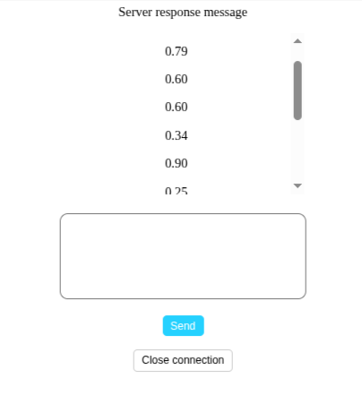

*重点在于理解练习webSocket通信机制，后端使用express  express-ws进行websocket支持*

*The focus is on understanding the practice of WebSocket communication mechanisms, with the backend utilizing Express and express-ws for WebSocket support.*

## 安装依赖

npm install

## 启动
npm start

## 访问
http://localhost:3000